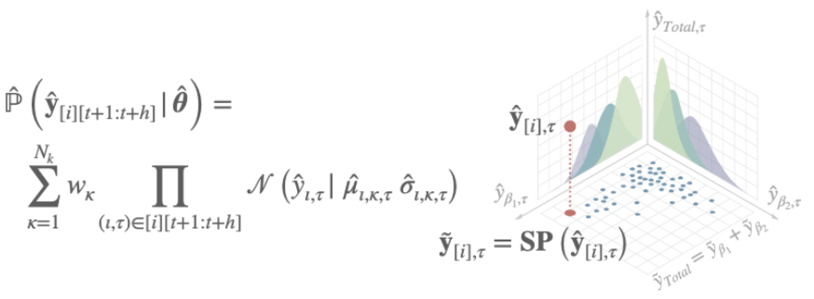
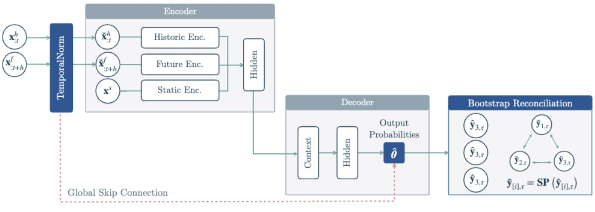
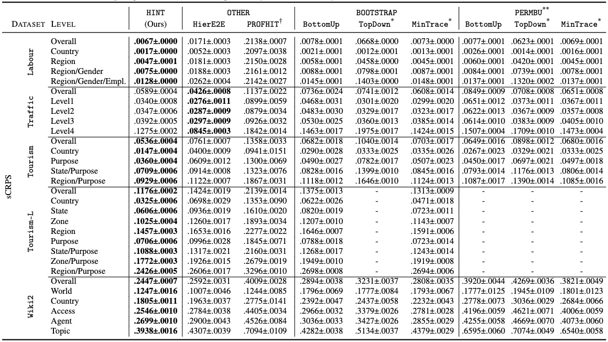

# HINT: Hierarchical Mixture Networks For Coherent Probabilistic Forecasting
We present the Hierarchical Mixture Networks (HINT), a model family for efficient and accurate coherent forecasting. We specialize the networks on the task via a multivariate mixture optimized with composite likelihood and made coherent via bootstrap reconciliation. 

Additionally, we robustify the networks to stark time series scale variations, incorporating normalized feature extraction and recomposition of output scales within their architecture.

We demonstrate improved accuracy on several datasets compared to the existing state-of-the-art. 

## Getting Started
To start using the HINT repository, run the following:
1. `bash setup.sh`
2. `conda activate HINT`

Now, you can run run_hint.py. For the jupyter notebooks, upload them to Colab to run on GPU.
