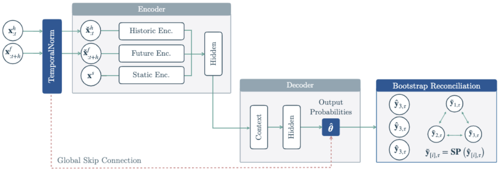

# HINT: Hierarchical Mixture Networks For Coherent Probabilistic Forecasting
We introduce Hierarchical Coherent Networks (HINT), a simple and general framework that can augment any neural network-based forecasting methods to ensure probabilistic coherence across hierarchical levels without assuming specific distributions.

HINT makes neural forecasting methods robust to time series scale variations and adapts their forecast distributions through bootstrap reconciliation.

Leveraging HINT’s agnostic modularity, we augment proven network architectures with a flexible coherent multivariate mixture distribution, yielding significant 13.2% accuracy improvements on most datasets compared to state-of-the-art baselines.

## Getting Started
To start using the HINT repository, run the following:
1. `bash setup.sh`
2. `conda activate HINT`
3. `(HINT) usr/path/ ~ % python run_hint.py`

For the jupyter notebooks, upload them to Colab to run on GPU.
